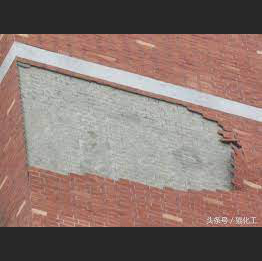
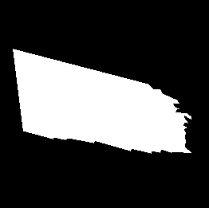
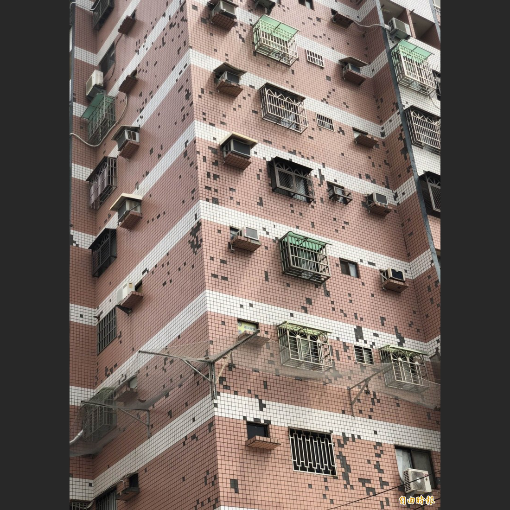
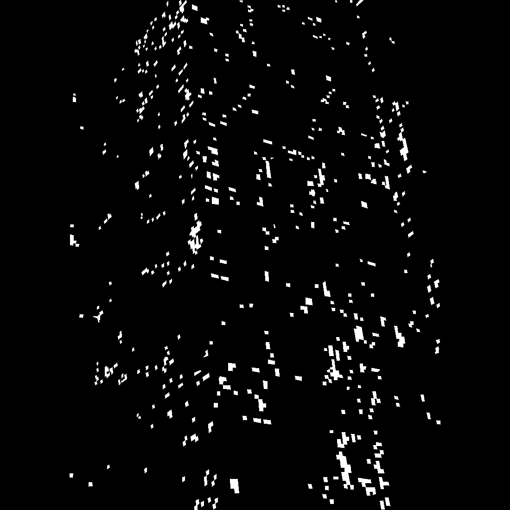
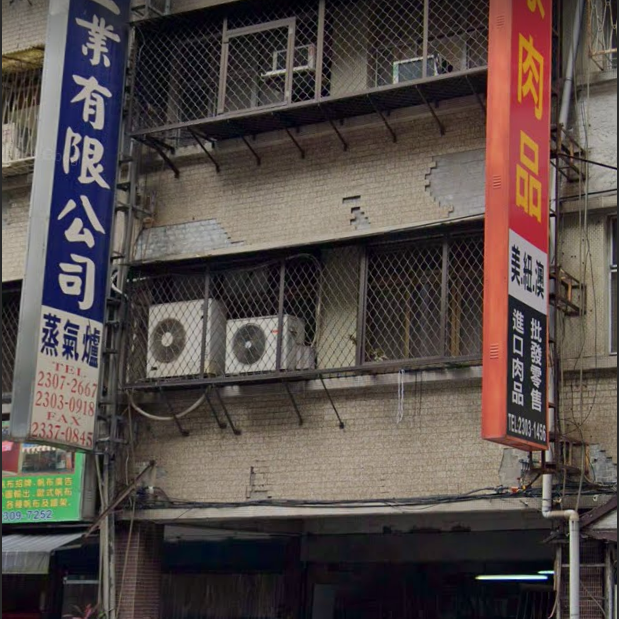
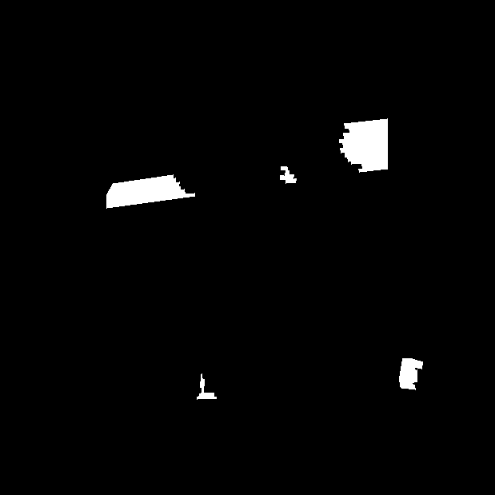

# TileSpall
This dataset comprises **364 images of tile spalling on building façades**, collected to support research on façade damage detection and segmentation. The dataset is designed to reflect real-world variability in spalling appearance and building conditions.

## Overview

The whole data collection process aims to capture the high variability of tile spalling, involving the search for spalling images and manual annotation of spalling areas. To maintain the high variability of building and tile spalling, 90\% of the images were obtained from Google Street View, 6.5\% were captured using smartphones, and the remaining 3.5\% were sourced from various social media platforms. This collection includes all seasons in 10 cities located in Taiwan, resulting in a dataset of 364 damaged images. To facilitate clear observation of spalling representation, all images were captured from the front of buildings.

## Example Images

<table>
  <tr>
    <td></td>
    <td></td>
  </tr>
  <tr>
    <td></td>
    <td></td>
  </tr>
  <tr>
    <td></td>
    <td></td>
  </tr>
</table>

> *Each column shows an original image (left) and its manually annotated mask (right). Spalling areas are marked in white.*

## Download

You can download the dataset from the following link:

🔗 **[https://ce13078.ce.ntu.edu.tw/open_datasets/spalling_data.zip](https://ce13078.ce.ntu.edu.tw/open_datasets/spalling_data.zip)**

Or use the command-line to download and unzip:

```bash
wget https://ce13078.ce.ntu.edu.tw/open_datasets/spalling_data.zip
unzip spalling_data.zip
```
## License

Details included in the LICENSE file.

## Citation

If you use the TileSpall dataset in your research or publication, please cite the following paper:

```bibtex
@article{WANG2025113589,
  title = {A novel multi-scale feature fusion network for tile spalling segmentation in building exterior},
  journal = {Journal of Building Engineering},
  volume = {112},
  pages = {113589},
  year = {2025},
  issn = {2352-7102},
  doi = {https://doi.org/10.1016/j.jobe.2025.113589},
  url = {https://www.sciencedirect.com/science/article/pii/S2352710225018261},
  author = {Hai-Wei Wang and Rih-Teng Wu},
  keywords = {Structural health monitoring, Tile spalling segmentation, Deep learning, Network architectures},
}
```
